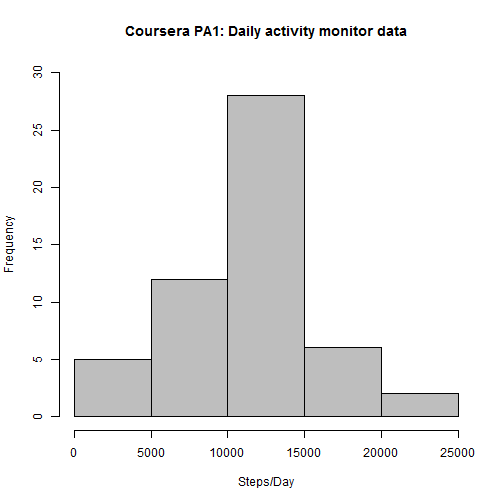
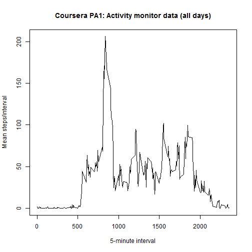
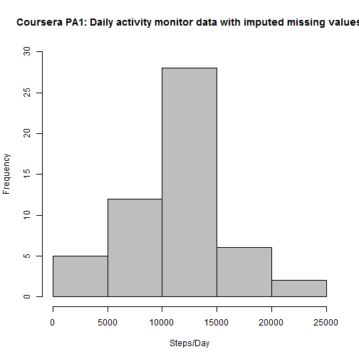
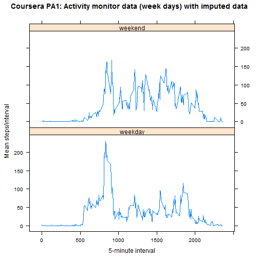

#Coursera Reproducible Research: Peer Assessment 1

##Introduction

It is possible to collect a large amount of data about personal movement using activity monitoring devices such as a [Fitbit](http://www.fitbit.com/), [Nike Fuelband](http://www.nike.com/us/en_us/c/nikeplus-fuelband), or [Jawbone Up](https://jawbone.com/up). These type of devices are part of the "quantified self" movement - enthusiasts who take measurements about themselves regularly to improve their health, to find patterns in their behavior, or because they are tech geeks. But these data remain under-utilized because the raw data are hard to obtain and there is a lack of statistical methods and software for processing and interpreting the data.

This assignment uses data from a personal activity monitoring device which collects data at 5 minute intervals through out the day. The data consists of two months of data from an anonymous individual collected during October - November 2012 and include the number of steps taken in 5 minute intervals each day.

##Assignment

The purpose of this assignment is to:

- Load and process data
- Impute missing values
- Interpret the data to answer questions
- Use **R Markdown** and **knitr** to present the results in an HTML file
- Push completed files to a forked GitHub repository

##Data

The data for this assignment can be downloaded from the course web site:

- Dataset: [Activity monitoring data](https://d396qusza40orc.cloudfront.net/repdata%2Fdata%2Factivity.zip) [52K]

The variables included in this dataset are:

- **steps**: Number of steps taking in a 5-minute interval (missing values are coded as NA)

- **date**: The date on which the measurement was taken in YYYY-MM-DD format

- **interval**: Identifier for the 5-minute interval in which measurement was taken

The dataset is stored in a comma-separated-value (CSV) file.  There are 17,568 observations in this dataset.

##Loading and preprocessing the data

This R code:

1. Loads the data

2. Processes/transforms dates into a format suitable for analysis


```r
activity.zip <- tempfile()
download.file("http://d396qusza40orc.cloudfront.net/repdata%2Fdata%2Factivity.zip",
              activity.zip)
unzip(activity.zip)
activity <- read.csv("activity.csv", header = TRUE)
activity$date <- as.Date(as.character(activity$date), "%Y-%m-%d")
```

##What is mean total number of steps taken per day?

Missing dataset values are ignored for this part of the assignment.

This R code:

1. Calculates the total number of steps taken per day

2. Creates a histogram of the total number of steps taken each day

3. Calculates and reports the mean and median of the total number of steps taken per day


```r
library(dplyr)
```

```r
daily.activity <- group_by(activity, date)
daily.activity.summary <- summarize(daily.activity, total.steps = 
                                            sum(steps, na.rm = TRUE))
daily.activity.summary <- 
        daily.activity.summary[!(daily.activity.summary$total.steps == 0),]
hist(daily.activity.summary$total.steps, 
     main = paste("Coursera PA1: Daily activity monitor data"), 
     col = "gray", xlab = "Steps/Day", ylim = c(0,30))
```

 

```r
print(paste("Mean total steps per day =", 
            round(mean(daily.activity.summary$total.steps))))
```

```
## [1] "Mean total steps per day = 10766"
```

```r
print(paste("Median total steps per day =", 
            round(median(daily.activity.summary$total.steps))))
```

```
## [1] "Median total steps per day = 10765"
```

####**Note**: The mean and median total number of steps per day are almost equal, implying a symmetrical distribution.

##What is the average daily activity pattern?

This R code:

1. Creates a time series plot of the 5-minute interval and the average number of steps taken, averaged across all days

2. Determines which 5-minute interval (on average across all the days in the dataset) contains the maximum number of steps


```r
interval.activity <- group_by(activity, interval)
interval.activity.summary <- summarize(interval.activity, 
                                       mean.steps = mean(steps, na.rm = TRUE))
plot(interval.activity.summary$interval, interval.activity.summary$mean.steps, 
     type = 'l', 
     main = paste("Coursera PA1: Activity monitor data (all days)"), 
     xlab = "5-minute interval", ylab = "Mean steps/interval")
```

 

```r
max.steps <- subset(interval.activity.summary, mean.steps == 
                            max(interval.activity.summary$mean.steps))
print(paste("5-minute interval with maximun mean steps =", max.steps$interval))
```

```
## [1] "5-minute interval with maximun mean steps = 835"
```

####**Note**: The 5-minute interval with maximun mean steps occurs at 0835.

##Imputing missing values

There are a number of days/intervals where there are missing values (coded as NA). The presence of missing days may introduce bias into some calculations or summaries of the data.

This R code:

1. Calculates and reports the total number of missing values in the dataset (i.e. the total number of rows with NAs)

2. Fills in all of the missing values in the dataset using the mean for that 5-minute interval computed above.

3. Creates a new dataset that is equal to the original dataset but with the missing data filled in.

4. Creates a histogram of the total number of steps taken each day.

5. Calculates and reports the mean and median total number of steps taken per day. Do these values differ from the estimates from the first part of the assignment? What is the impact of imputing missing data on the estimates of the total daily number of steps?


```r
print(paste("Total number of missing step values =", sum(is.na(activity$steps))))
```

```
## [1] "Total number of missing step values = 2304"
```

```r
imputed.activity <- activity
for (n in seq(nrow(imputed.activity))) {
        if (is.na(imputed.activity[n, "steps"])) {
                i <- imputed.activity[n, "interval"]
                imputed.activity[n, "steps"] <-  
                        interval.activity.summary[interval.activity.summary$interval ==
                                                          i, ][, 2]
        }        
}
imputed.daily.activity <- group_by(imputed.activity, date)
imputed.daily.activity.summary <- 
        summarize(imputed.daily.activity, total.steps = sum(steps, na.rm = TRUE))
imputed.daily.activity.summary <- 
        imputed.daily.activity.summary[
                !(imputed.daily.activity.summary$total.steps == 0),]
hist(daily.activity.summary$total.steps, 
     main = paste("Coursera PA1: Daily activity monitor data with imputed missing values"), 
     col = "gray", xlab = "Steps/Day", ylim = c(0,30))
```

 

```r
print(paste("Imputed mean total steps per day =", 
            round(mean(imputed.daily.activity.summary$total.steps))))
```

```
## [1] "Imputed mean total steps per day = 10766"
```

```r
print(paste("Imputed median total steps per day =", 
            round(median(imputed.daily.activity.summary$total.steps))))
```

```
## [1] "Imputed median total steps per day = 10766"
```

####**Note**: The mean and median total number of steps taken per day do not significantly differ from the estimates from the first part of the assignment above.

This R code determines the distribtion of the missing values.


```r
missing.activity <- subset(activity, is.na(steps))
table(missing.activity$date)
```

```
## 
## 2012-10-01 2012-10-08 2012-11-01 2012-11-04 2012-11-09 2012-11-10 
##        288        288        288        288        288        288 
## 2012-11-14 2012-11-30 
##        288        288
```

####**Note**: There is minimal impact of imputing missing data on the estimates of the total daily number of steps since the missing values are evenly distributed among eight days as above.

##Are there differences in activity patterns between weekdays and weekends?

This part uses the dataset with the filled-in missing values.

This R code:

1. Creates a new factor variable in the dataset with two levels - "weekday" and "weekend" indicating whether a given date is a weekday or weekend day.

2. Creates a panel plot containing a time series plot of the 5-minute interval and the average number of steps taken, averaged across all weekday or weekend days.


```r
day.interval.activity <- mutate(imputed.activity, day = "weekday")
day.interval.activity[weekdays(day.interval.activity$date) ==
                             "Saturday" | weekdays(day.interval.activity$date) ==
                              "Sunday","day"] <- "weekend"
day.interval.activity[, "day"] <- as.factor(day.interval.activity[, "day"])
day.interval.activity <- group_by(day.interval.activity, interval, day)
day.interval.activity.summary <- summarize(day.interval.activity, mean.steps =
                                                   mean(steps, na.rm = TRUE))
library(lattice)
xyplot(mean.steps ~ interval | day, data = day.interval.activity.summary, 
       main = "Coursera PA1: Activity monitor data (week days) with imputed data",
       xlab = "5-minute interval",  ylab = "Mean steps/interval", 
       layout = c(1,2), type = 'l')
```

 

####**Note**: Weekend activity is more evenly distributed throughout the waking day, while weekday activity is concentrated in the morning (probably at work).
